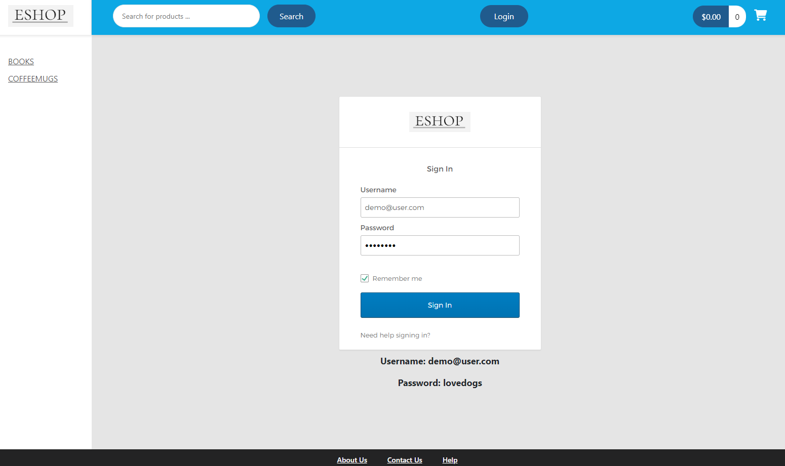
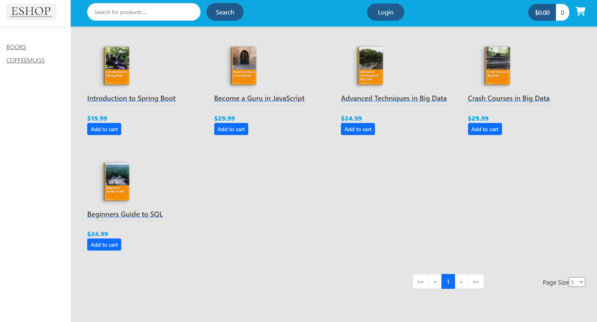
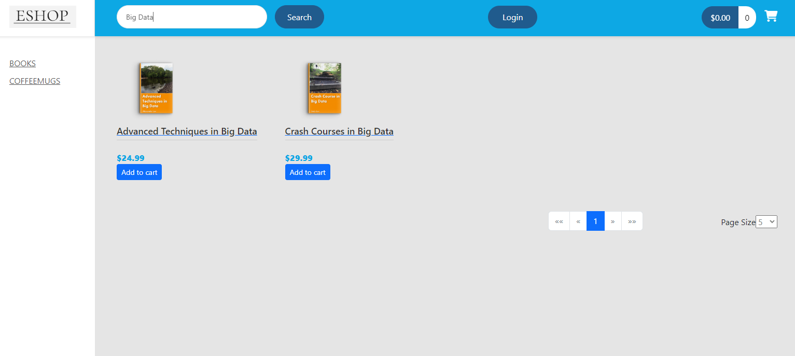
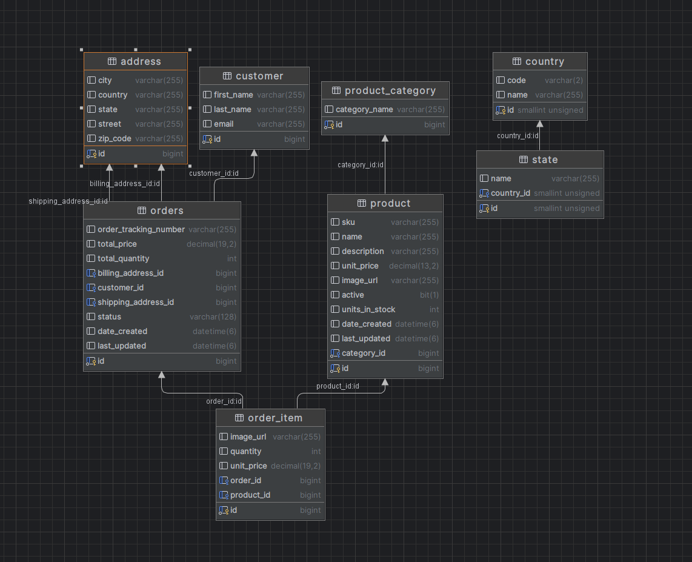

# Eshop
[>>>Live Site<<<](https://www.ecommerce.jimmyxj.com/)

Eshop is a sophisticated online shopping web application designed to elevate your shopping experience. 
Our application empowers users to effortlessly create and manage their profiles, ensuring a personalized journey. 
With user-friendly features, you can easily add and organize items in your shopping cart. 
Our powerful search and filtering options simplify the process of finding the products you desire. 
Moreover, we prioritize your security during the checkout process, offering a safe and secure transaction environment. 
Shop with confidence on Eshop, where convenience meets quality.

The Frontend repository can be found [>>>here<<<](https://github.com/ccnuxuji/ecommerce_backend)
## Technology used
**Frontend:** TypeScript, Html, CSS, Angular

**Backend:** Java, Spring Boot, Spring Data JPA, Mysql

**Third-party service:** Stripe, Okta

## Feature Lists

1. Log in, and demo user
   

2. Product Catalog:
   

3. Search and Filters:
   

4. Shopping Cart:
   

## Getting started
1. Clone this repository:

   `
   https://github.com/ccnuxuji/coinguard.git
   `
2. Install dependencies into the Backed and the Frontend by making a terminal for each one and then run the following:

    * `npm install`

3. Start project using:
    * `npm start`

## Schema

## Contact me

Jimmy Xu, ccnuxuji@gmail.com, [Linkedin](https://www.linkedin.com/in/ccnuxuji/)
